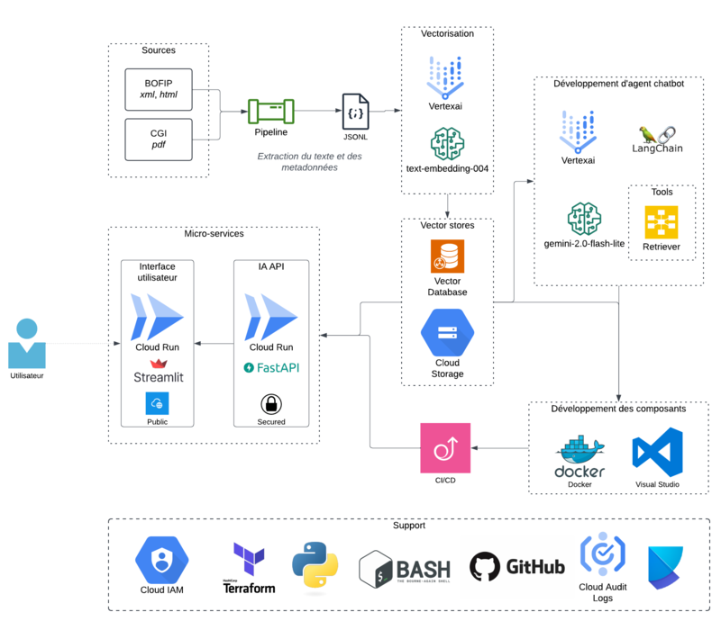

# Fiscalia

## 🔗 Accédez à l'assistant

**🌐 https://fiscalia.cloud**

Vous pouvez désormais utiliser l'assistant fiscal en ligne via l'URL personnalisée ci-dessus. Il s'agit d'une instance déployée sur Google Cloud Run avec une interface utilisateur accessible publiquement.

---

## 📄 Description
Fiscalia est un projet visant à développer un Large Language Model (LLM) spécialisé dans le domaine de la fiscalité. L'objectif est de créer un assistant intelligent capable de répondre avec précision aux questions fiscales, en s'appuyant sur une base de connaissances spécialisée et régulièrement mise à jour.

---

## 📂 Sources de données
Le projet s'appuie principalement sur les données open source du [Bulletin Officiel des Finances Publiques (BOFiP)](https://data.economie.gouv.fr/explore/dataset/bofip-impots/api/), qui constitue la documentation officielle de l'administration fiscale française. Ces données sont :

- Publiques et accessibles à tous
- Régulièrement mises à jour
- Faisant autorité en matière fiscale
- Structurées par thématiques

---

## 🌟 Objectifs
- Créer un LLM spécialisé en fiscalité
- Fournir des réponses précises et à jour sur les questions fiscales
- Assurer la traçabilité des sources utilisées
- Maintenir une base de connaissances fiscales actualisée
- Faciliter l'accès et la compréhension du BOFiP

---

## 📊 Architecture applicative

---

## 🚀 Modules

### 🔹 Data Collection
Module de collecte de données fiscales depuis diverses sources comme le BOFiP. L'objectif est d'automatiser la collecte de données et rendre le code modulaire en fonction de la destination choisie (local/Azure).
[Plus de détails](./data_collection/README.md)

### 🔹 Machine Learning (work in progress)
La partie machine learning s'appuie sur le framework **LangChain**.

L'idée est d'adopter une approche basée sur des agents avec les outils suivants :
- Un retriever pour les données du BOFiP, avec citation des sources
- Un outil de recherche web, limité à des sources de référence

LLM envisagé :
- Utilisation de **Gemini 2.0 Flash Lite** pour le raisonnement, et **text-embedding-004** pour la vectorisation des documents, via Vertex AI. Ces modèles ont été choisis pour leur performance, leur coûts raisonnables et leur compatibilité avec les workflows Google Cloud.

[Plus de détails](./machine_learning/README.md)

---

## ⚖️ Installation
Chaque module utilise **Poetry** pour la gestion des dépendances. Consultez les README respectifs pour les instructions d'installation spécifiques.

---

## ✨ Contribution
Les contributions sont les bienvenues ! Voir [CONTRIBUTING.md](CONTRIBUTING.md) pour plus de détails.

---

## 📃 Licence
Ce projet est sous licence **Apache 2.0**. Voir le fichier [LICENSE](LICENSE) pour plus de détails.

---

## 🔒 Note légale
Ce LLM est conçu comme un outil d'aide et d'information et **ne remplace en aucun cas** l'expertise d'un professionnel de la fiscalité. Les réponses fournies ne constituent pas un conseil fiscal officiel.

---

## 📖 Mentions légales
Les données utilisées dans ce projet proviennent du **Bulletin Officiel des Finances Publiques (BOFiP)**, une ressource publique mise à disposition par la Direction Générale des Finances Publiques. Leur utilisation est conforme à leur statut de données publiques.

