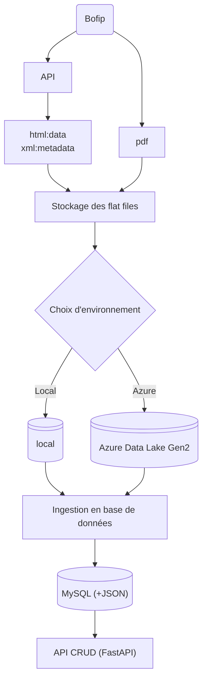

# Fiscalia Data Collection

Projet de collecte et d'analyse des données fiscales françaises. Ce projet fait partie d'une certification et vise à automatiser la collecte des données du BOFiP (Bulletin Officiel des Finances Publiques).

## Prérequis

### Base de données
1. Installer et configurer MySQL sur votre système.
   Pour des instructions détaillées, consultez [le guide d'installation MySQL](docs/database_requirements.md).

2. Démarrer le service MySQL :
   - Sur macOS : `brew services start mysql`
   - Sur Ubuntu/Debian : `sudo service mysql start`
   - Sur Windows : Via le gestionnaire de services

3. Configurer un utilisateur MySQL avec les droits nécessaires :
```sql
CREATE USER 'your_user'@'localhost' IDENTIFIED BY 'your_password';
GRANT ALL PRIVILEGES ON *.* TO 'your_user'@'localhost';
FLUSH PRIVILEGES;
```

## Installation

1. Cloner le dépôt :
```bash
git clone <repository_url>
cd fiscalia_data_collection
```

2. Installer les dépendances avec Poetry :
```bash
poetry install
```

3. Copier le fichier de configuration :
```bash
cp .env.example .env
```

4. Modifier le fichier `.env` avec vos paramètres :
```env
DB_USER=your_user
DB_PASSWORD=your_password
```

5. Initialiser la base de données :
```bash
poetry run python scripts/init_database.py
```

## Pipeline de données



## Architecture

```
fiscalia_data_collection/
├── scripts/                      # Scripts d'exécution
│   ├── run_api.py               # Lance l'API
│   └── run_bofip_data_collection.py  # Pipeline de collecte BOFiP
├── src/                         # Code source
│   ├── api/                    # API FastAPI
│   ├── config/                 # Configuration
│   ├── data_extraction/        # Extracteurs de données
│   ├── data_transformation/    # Transformation des données
│   │   ├── decompressor.py    # Décompression des fichiers
│   │   └── normalizer.py      # Normalisation des données
│   ├── storage/               # Gestion du stockage
│   └── utils/                 # Utilitaires
├── docs/                      # Documentation
│   └── mermaid.MD            # Diagrammes du projet
├── notebooks/                 # Notebooks d'exploration
└── tests/                    # Tests unitaires
```

## Utilisation

Le script principal permet d'exécuter tout ou partie du pipeline de collecte :

```bash
# Pipeline complet
poetry run python scripts/run_bofip_data_collection.py

# Étapes spécifiques
poetry run python scripts/run_bofip_data_collection.py --steps extract decompress
poetry run python scripts/run_bofip_data_collection.py --steps transform

# API
poetry run python scripts/run_api.py
```

## Configuration

Créez un fichier `.env` basé sur `.env.example` :

```env
# Stockage (local ou azure)
STORAGE_TYPE=local

# API BOFiP
BOFIP_API_URL=https://...
BOFIP_API_LIMIT=20
```

## Azure Data Lake Storage

Pour utiliser Azure Data Lake Gen2, configurez dans `.env` :

```env
STORAGE_TYPE=azure
AZURE_STORAGE_ACCOUNT=compte
AZURE_STORAGE_KEY=clé
AZURE_CONTAINER=container
AZURE_DIRECTORY=bofip
```

## Développement

```bash
# Tests
poetry run pytest

# Formatage
poetry run black .
poetry run isort .
```

## Licence

Apache License 2.0