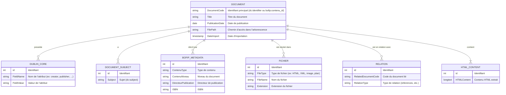
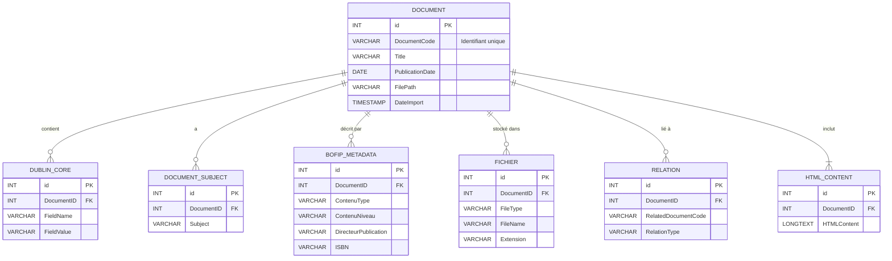
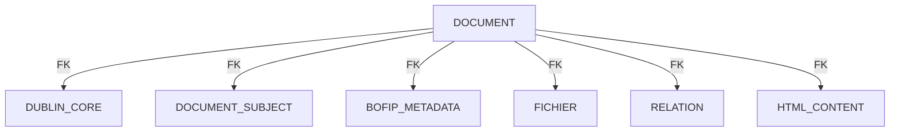
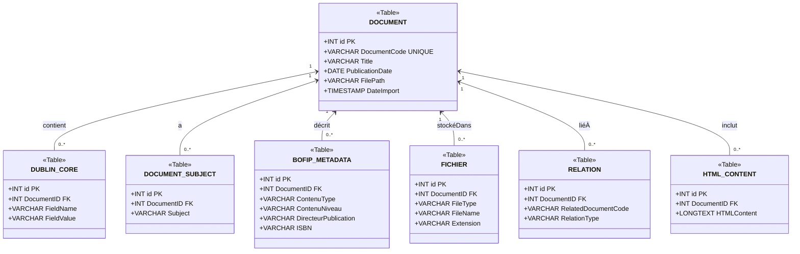

# Documentation de la Modélisation Merise pour l’Ingestion des Données BOFiP

## 1. Introduction

Ce document détaille la modélisation Merise utilisée pour ingérer les données extraites d’un fichier compressé (BOFiP) dans une base MySQL. L’approche proposée garantit une normalisation jusqu’à la 5NF et facilite l’application des règles RGPD (séparation et traçabilité des données personnelles).

---

## 2. Modèle Conceptuel de Données (MCD)

Les informations sont décomposées en entités distinctes pour éviter les redondances et permettre une gestion fine des attributs multivalués. Les entités identifiées sont :

- **DOCUMENT** : l’unité principale, identifiée par un code, un titre, une date de publication et le chemin d’accès dans l’arborescence.
- **DUBLIN_CORE** : les métadonnées standards (ex. : créateur, éditeur, langue, etc.).
- **BOFIP_METADATA** : les métadonnées spécifiques BOFiP (type de contenu, niveau, directeur de publication, ISBN).
- **FICHIER** : les fichiers associés (HTML, XML, images, plan), avec leur chemin et nom.
- **RELATION** : les liens entre documents (ex. : references, isReferencedBy).
- **HTML_CONTENT** : le contenu textuel extrait du fichier HTML.
- **DOCUMENT_SUBJECT** : les sujets (dc:subject) pouvant être multiples par document.

### Schéma MCD



---

## 3. Modèle Logique de Données (MLD)

Le MLD traduit chaque entité du MCD en une table relationnelle avec des clés primaires et étrangères pour garantir l’intégrité référentielle. Voici la structure des tables :

- **DOCUMENT (PK: id)**
  - DocumentCode (unique)
  - Title
  - PublicationDate
  - FilePath
  - DateImport

- **DUBLIN_CORE**
  - id (PK)
  - DocumentID (FK vers DOCUMENT.id)
  - FieldName
  - FieldValue

- **DOCUMENT_SUBJECT**
  - id (PK)
  - DocumentID (FK vers DOCUMENT.id)
  - Subject

- **BOFIP_METADATA**
  - id (PK)
  - DocumentID (FK vers DOCUMENT.id)
  - ContenuType
  - ContenuNiveau
  - DirecteurPublication
  - ISBN

- **FICHIER**
  - id (PK)
  - DocumentID (FK vers DOCUMENT.id)
  - FileType
  - FileName
  - Extension

- **RELATION**
  - id (PK)
  - DocumentID (FK vers DOCUMENT.id)
  - RelatedDocumentCode
  - RelationType

- **HTML_CONTENT**
  - id (PK)
  - DocumentID (FK vers DOCUMENT.id)
  - HTMLContent

### Schéma MLD



---

## 4. Modèle Physique de Données (MPD)

Le MPD présente l’implémentation du MLD dans MySQL. En plus du script SQL, un schéma visuel enrichi permet de visualiser clairement les tables, leurs attributs avec types et contraintes ainsi que les relations avec les cardinalités.

### Schéma MPD (Flowchart simplifié)



### Schéma MPD Enrichi



### Exemple de Création de Tables en SQL

```sql
CREATE TABLE DOCUMENT (
    id INT AUTO_INCREMENT PRIMARY KEY,
    DocumentCode VARCHAR(100) NOT NULL UNIQUE,
    Title VARCHAR(255),
    PublicationDate DATE,
    FilePath VARCHAR(500),
    DateImport TIMESTAMP DEFAULT CURRENT_TIMESTAMP
);

CREATE TABLE DUBLIN_CORE (
    id INT AUTO_INCREMENT PRIMARY KEY,
    DocumentID INT NOT NULL,
    FieldName VARCHAR(100) NOT NULL,
    FieldValue VARCHAR(255),
    FOREIGN KEY (DocumentID) REFERENCES DOCUMENT(id) ON DELETE CASCADE
);

CREATE TABLE DOCUMENT_SUBJECT (
    id INT AUTO_INCREMENT PRIMARY KEY,
    DocumentID INT NOT NULL,
    Subject VARCHAR(255) NOT NULL,
    FOREIGN KEY (DocumentID) REFERENCES DOCUMENT(id) ON DELETE CASCADE
);

CREATE TABLE BOFIP_METADATA (
    id INT AUTO_INCREMENT PRIMARY KEY,
    DocumentID INT NOT NULL,
    ContenuType VARCHAR(50),
    ContenuNiveau VARCHAR(50),
    DirecteurPublication VARCHAR(255),
    ISBN VARCHAR(50),
    FOREIGN KEY (DocumentID) REFERENCES DOCUMENT(id) ON DELETE CASCADE
);

CREATE TABLE FICHIER (
    id INT AUTO_INCREMENT PRIMARY KEY,
    DocumentID INT NOT NULL,
    FileType VARCHAR(50),
    FileName VARCHAR(255),
    Extension VARCHAR(10),
    FOREIGN KEY (DocumentID) REFERENCES DOCUMENT(id) ON DELETE CASCADE
);

CREATE TABLE RELATION (
    id INT AUTO_INCREMENT PRIMARY KEY,
    DocumentID INT NOT NULL,
    RelatedDocumentCode VARCHAR(100) NOT NULL,
    RelationType VARCHAR(50),
    FOREIGN KEY (DocumentID) REFERENCES DOCUMENT(id) ON DELETE CASCADE
);

CREATE TABLE HTML_CONTENT (
    id INT AUTO_INCREMENT PRIMARY KEY,
    DocumentID INT NOT NULL,
    HTMLContent LONGTEXT,
    FOREIGN KEY (DocumentID) REFERENCES DOCUMENT(id) ON DELETE CASCADE
);
```

---

## 5. Conclusion

Le schéma proposé, basé sur la méthode Merise et normalisé jusqu’à la 5NF, permet de :

- Isoler chaque information dans des entités fines afin d’éviter toute redondance.
- Gérer les attributs multivalués (sujets, relations) via des tables dédiées.
- Assurer une traçabilité et une application des règles RGPD grâce à la centralisation des données sensibles.
- Faciliter l’ingestion et la maintenance des données dans MySQL.

Ce modèle offre une base solide pour l’ingestion et l’exploitation ultérieure des données BOFiP.