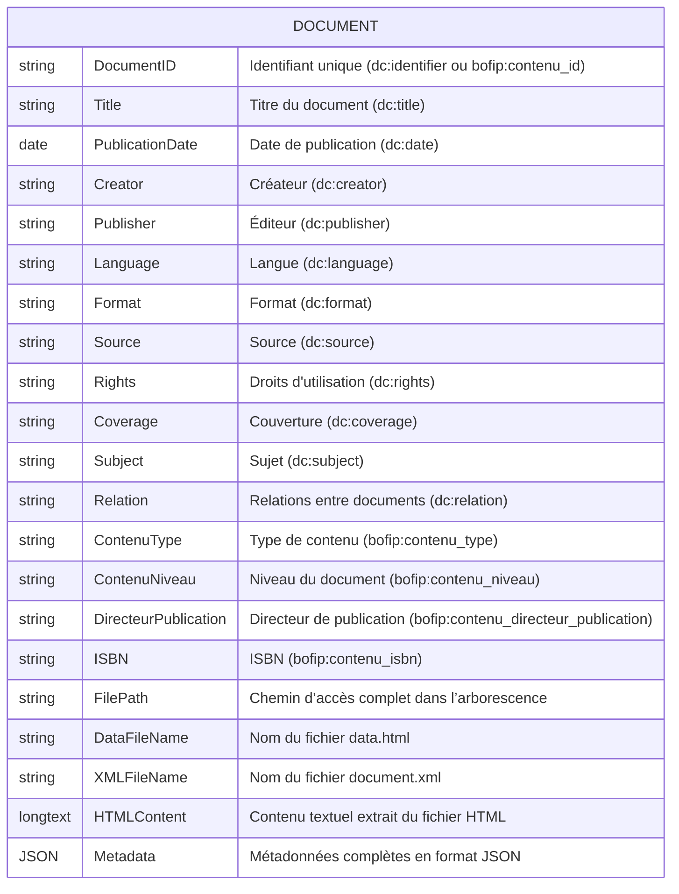
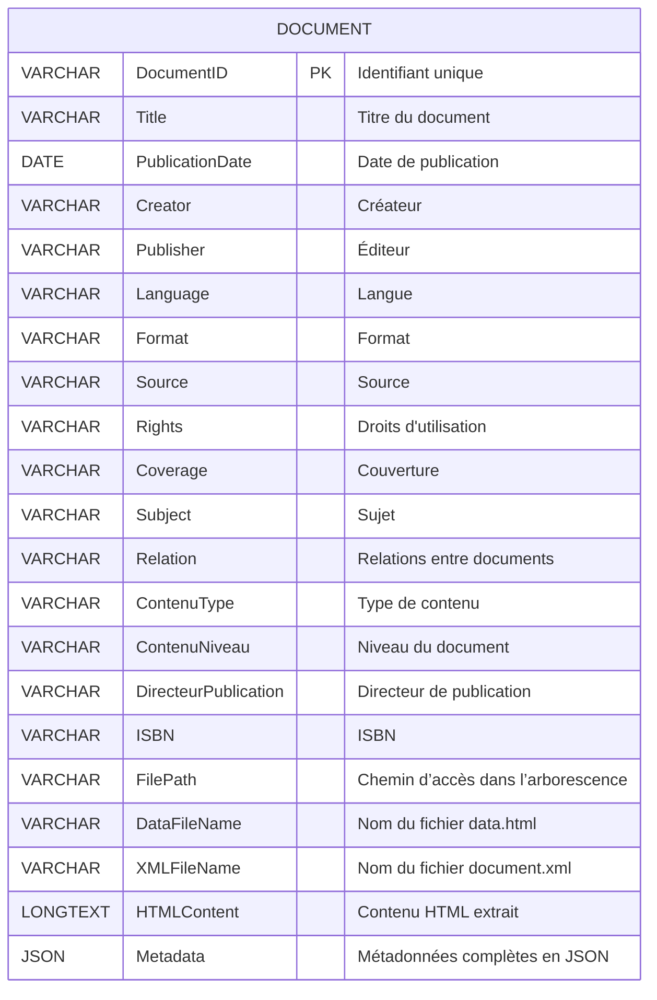
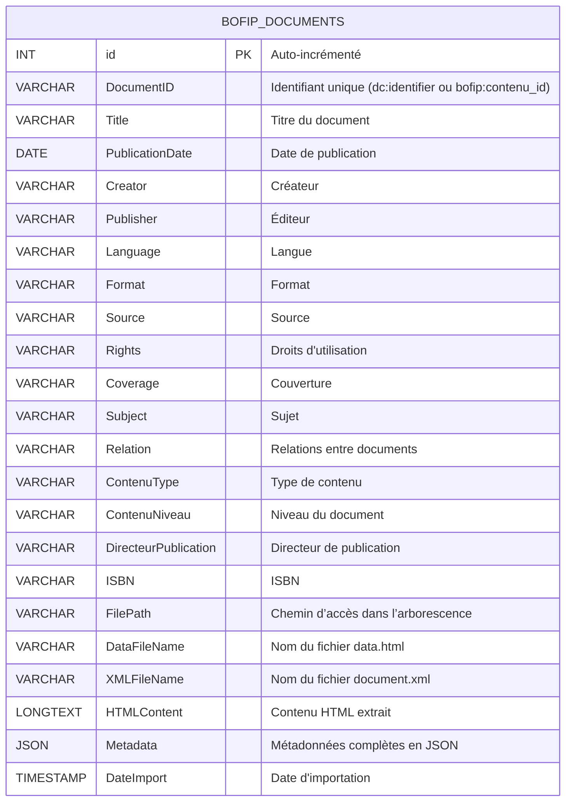

### 1. Modèle Conceptuel de Données (MCD)

**Analyse du domaine :**  
Les données issues de BOFiP se présentent sous la forme d’un document constitué de deux fichiers complémentaires :  
- **data.html** contient le contenu principal sous format HTML,  
- **document.xml** fournit les métadonnées au format XML (incluant les standards Dublin Core et les spécificités BOFiP).

**Choix réalisé :**  
Après analyse, nous avons identifié une entité centrale, **DOCUMENT**, qui regroupe toutes les informations nécessaires. En effet, le contenu HTML et les métadonnées sont étroitement liés pour chaque document, et la structure d’arborescence d’origine (chemin, nom de fichier, date de publication, type de document, etc.) est principalement descriptive.  
Cela justifie de modéliser l’ensemble sous une seule entité dans le MCD, sans nécessiter de normalisation poussée en entités séparées (comme Auteur ou Catégorie) pour ce contexte.

**schéma MCD**



---

### 2. Modèle Logique de Données (MLD)

**Traduction du MCD :**  
Nous avons converti le MCD en un modèle relationnel où toutes les informations relatives à un document sont contenues dans une seule table.  
Cette décision est justifiée par le fait que le document, en tant qu’unité d’information, regroupe à la fois le contenu et ses métadonnées.  
Les attributs tels que le chemin d’accès et les noms de fichiers permettent également de reconstituer la structure d’origine, sans avoir besoin de créer des tables séparées pour des entités qui ne nécessitent pas de relations complexes dans ce contexte.

**Schéma MLD**



---

### 3. Modèle Physique de Données (MPD)

**Implémentation dans le SGBD :**  
Pour le MPD, nous avons défini les types de données adaptés à un SGBD relationnel (MySQL ou PostgreSQL) avec les contraintes nécessaires (clé primaire, index éventuels, suivi d’import).  
Nous avons choisi de stocker le contenu HTML et les métadonnées sous forme JSON afin de garder une flexibilité maximale pour l’interrogation et le traitement ultérieur (notamment pour la vectorisation via Chroma).

**MPD en Mermaid :**



**Exemple de création de table en SQL :**

```sql
CREATE TABLE BOFIP_DOCUMENTS (
    id INT AUTO_INCREMENT PRIMARY KEY,
    DocumentID VARCHAR(100) NOT NULL,
    Title VARCHAR(255),
    PublicationDate DATE,
    Creator VARCHAR(100),
    Publisher VARCHAR(100),
    Language VARCHAR(50),
    Format VARCHAR(50),
    Source VARCHAR(255),
    Rights VARCHAR(255),
    Coverage VARCHAR(255),
    Subject VARCHAR(255),
    Relation VARCHAR(255),
    ContenuType VARCHAR(50),
    ContenuNiveau VARCHAR(50),
    DirecteurPublication VARCHAR(255),
    ISBN VARCHAR(50),
    FilePath VARCHAR(500),
    DataFileName VARCHAR(255),
    XMLFileName VARCHAR(255),
    HTMLContent LONGTEXT,
    Metadata JSON,
    DateImport TIMESTAMP DEFAULT CURRENT_TIMESTAMP
);
```

---

### Conclusion et Justification

**Pourquoi une table unique ?**  
Dans ce contexte, le regroupement des informations dans une seule table permet de :
- Simplifier l’import des données issues d’un format semi-structuré,
- Faciliter l’extraction du texte pour la vectorisation,
- Répondre aux exigences RGPD en centralisant le contrôle des données,
- Éviter une sur-normalisation qui pourrait complexifier inutilement le système sans apporter de bénéfices analytiques supplémentaires.